## Selected Research & Projects

  <h3 class="project-title">Post-Stroke Rehabilitation System</h3>
  
May 2025 – Present

Wearable Sensing · EMG · IMU · EEG

A wearable system positioned near the ear to evaluate facial muscle function and support post-stroke speech rehabilitation. The system integrates EMG, IMU, and EEG signals for recovery monitoring and future mobile healthcare applications.

  <h3 class="project-title">Fall Detection Using IMU Sensor</h3>
  
Aug 2025

MPU6050 · ESP32 · Embedded Sensing

  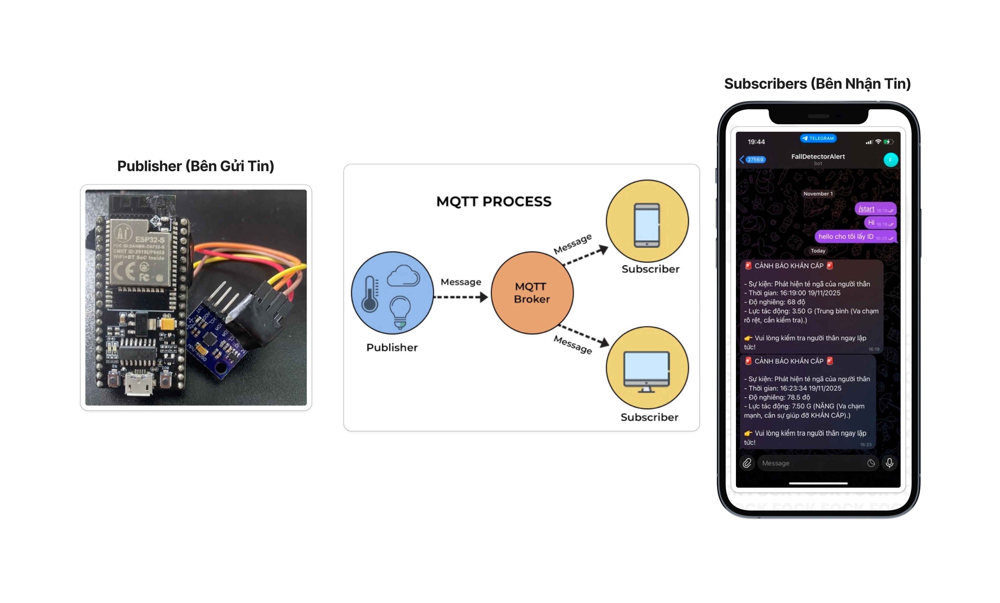
  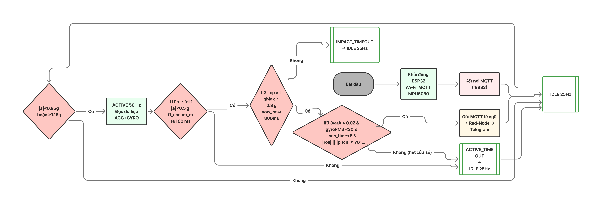

Developed a fall detection system for elderly users in home environments using the MPU6050 IMU sensor and ESP32. Combined accelerometer and gyroscope data to detect motion, acceleration, rotation, and tilt.

  <h3 class="project-title">CNN-Based Data Interpolation</h3>
  
Dec 2024

CNN · SRGAN · Super-Resolution

  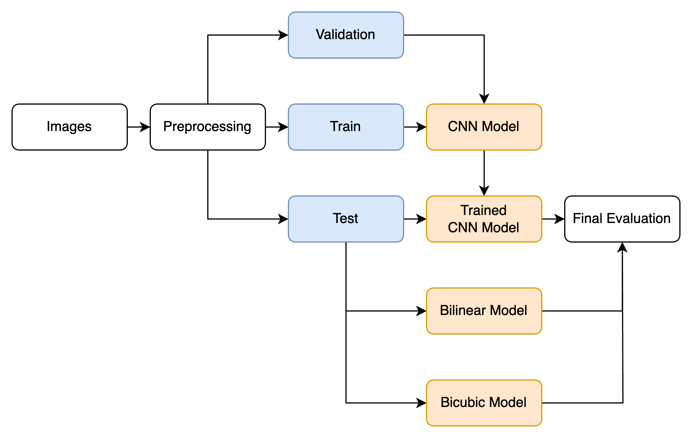
  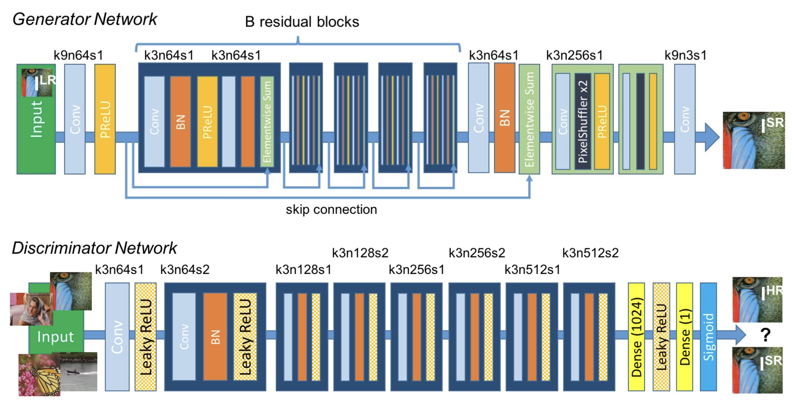
  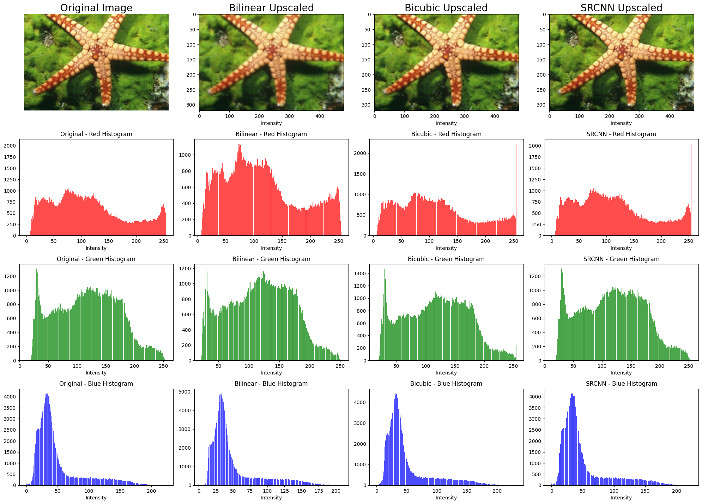

Explored CNN-based interpolation and SRGAN super-resolution methods to reconstruct high-resolution details from low-resolution images, improving image quality for computer vision and medical imaging tasks.

  <h3 class="project-title">AI-Assisted Bowel Wall Thickness Assessment</h3>
  
Aug 2024

Medical Imaging · Machine Learning · C#

  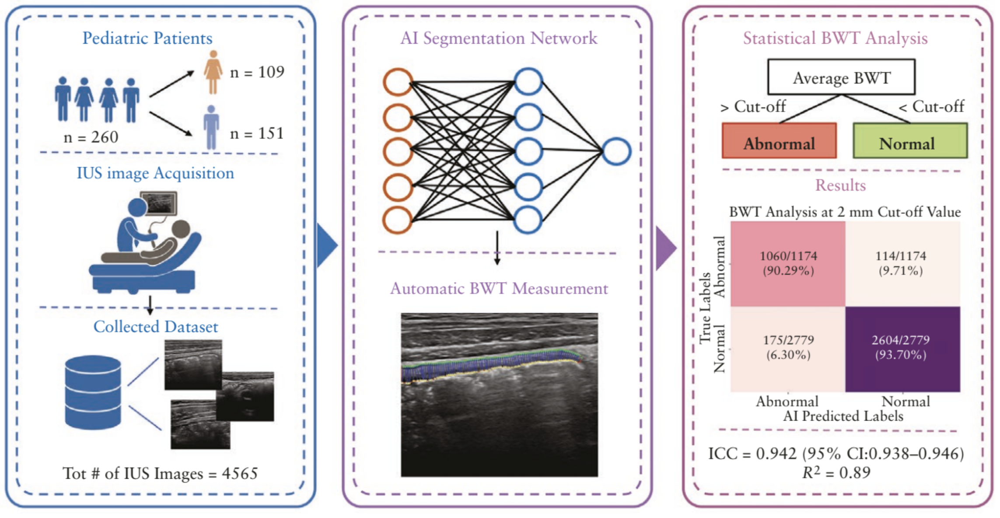
  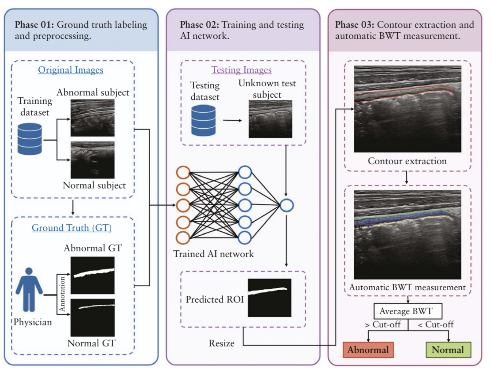

Developed AI models to assess bowel wall thickness in pediatric inflammatory bowel disease using intestinal ultrasound images. Built a user-friendly C# interface for healthcare professionals in clinical settings.

  <a href="https://pubmed.ncbi.nlm.nih.gov/40052532/">PubMed</a>
  <a href="https://doi.org/10.1093/ecco-jcc/jjaf037">DOI</a>

  <h3 class="project-title">Breast Tumor Classification from Ultrasound Images</h3>
  
Mar 2024

Texture Analysis · Neuro-Fuzzy Model

  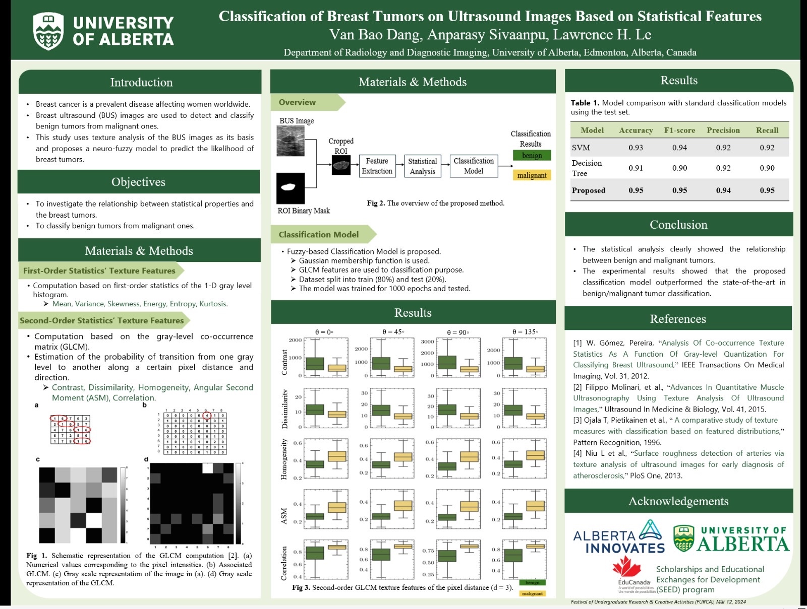

Used statistical texture analysis and a neuro-fuzzy model to classify benign and malignant breast tumors from ultrasound images.

  <h3 class="project-title">Vietnamese Voice Bot for Financial Services</h3>
  
Nov 2023

NLP · TTS · Scrum · Business Analysis

Contributed to a Vietnamese NLP model and TTS integration for a voice bot tailored to real-time financial conversations.

  <h3 class="project-title">Vinamilk Stock Price Forecasting and Investment Decision Support</h3>
  
July 2023

Linear Regression · XGBoost · LSTM

  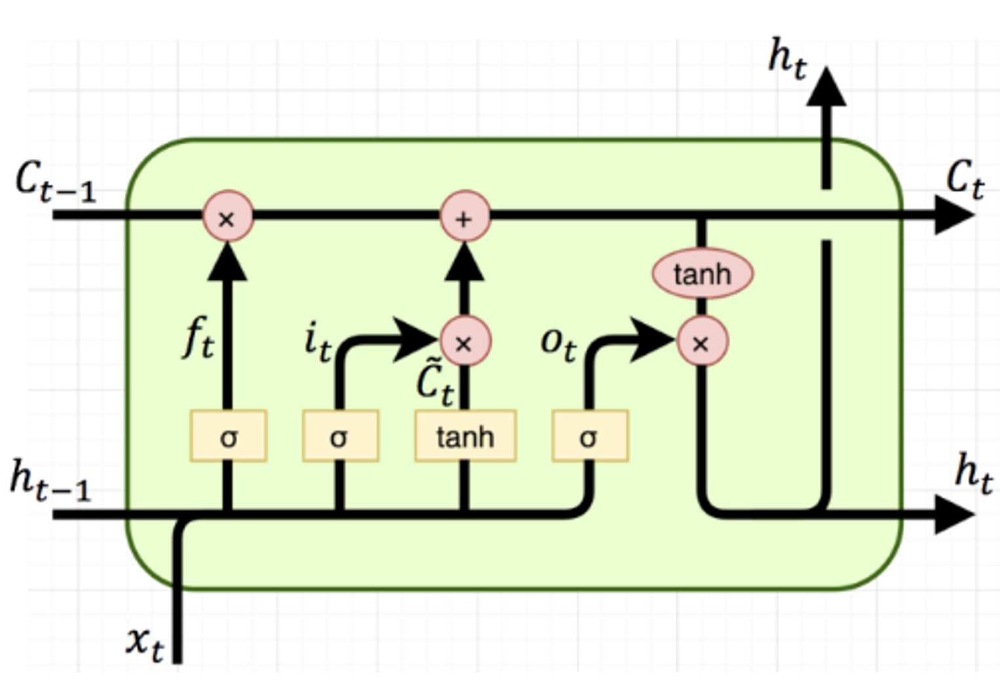
  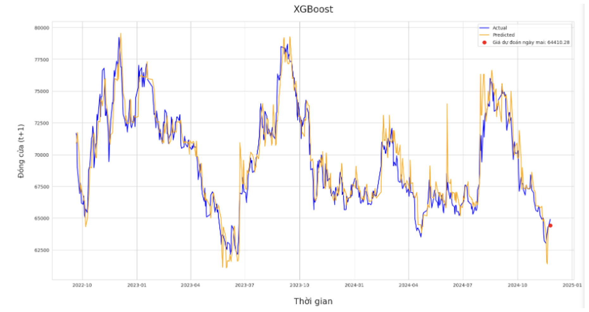
  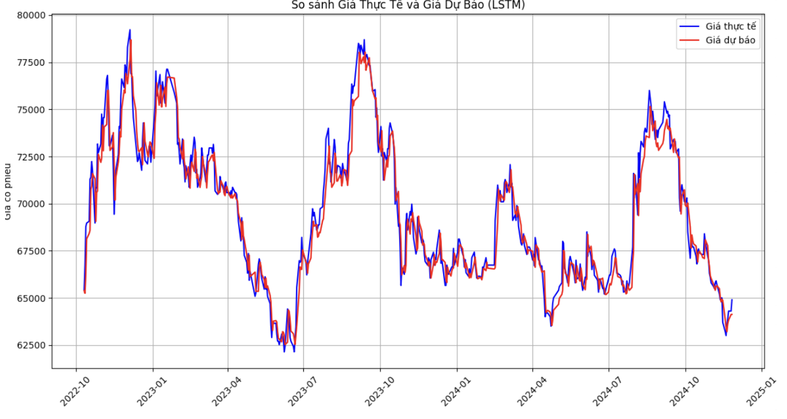

Applied Linear Regression, XGBoost, and LSTM models to forecast stock prices and compared their performance using RMSE, MAE, and R-squared.

## Honors & Awards

  <h3 class="award-title">Graduate Research Assistantship</h3>
  
Feb 2026

Department of Computer Science · University of Montana

Awarded a fully funded research assistantship to pursue a Ph.D. in Computer Science.

  <h3 class="award-title">Consolation Prize</h3>
  
Mar 2024

Festival of Undergraduate Research and Creative Activities · University of Alberta

Recognized for the project <em>Classification of Breast Tumors on Ultrasound Images Based on Texture Analysis</em>.

  <h3 class="award-title">SEED Scholarship</h3>
  
Jun 2023

Canadian Government Sponsored

Awarded a 100% scholarship valued at <strong>$15,900</strong> to support eight months of undergraduate research.

  <h3 class="award-title">Top 8</h3>
  
Dec 2022

START UP DEMODAY · International University — VNU HCMC

Recognized for the project <em>Psychological Counseling Application</em>.

  <h3 class="award-title">Top 3</h3>
  
Dec 2021

GREENOVATOR HACKATHON · Bosch Vietnam

Awarded for the project <em>Air Quality Forecasting Application</em>.

  <h3 class="award-title">Top 10</h3>
  
Jun 2020

BUSINESS INTELLIGENCE SEASON 5 · University of Economics and Law

Recognized for the project <em>Forecasting Sales Trends and Analyzing Customer Behavior</em>.

  <h3 class="award-title">Consolation Prize</h3>
  
Dec 2019

HACKATHON 2020 · Ho Chi Minh City University of Technology and Education

Recognized for the project <em>Time Management Application for Students and Lecturers</em>.

  <h3 class="award-title">IELTS 7.0</h3>

